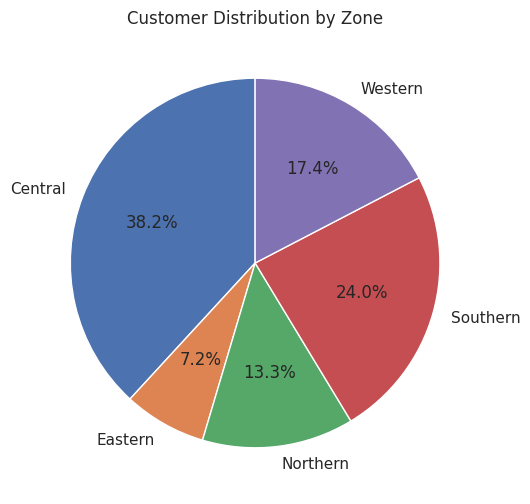
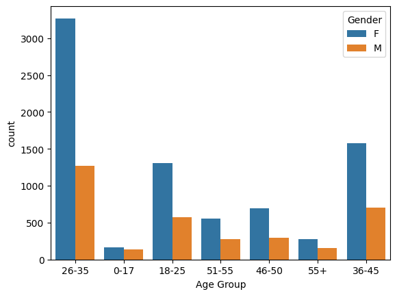

# 🛍️ Diwali Sales Data Analysis (Python, Pandas, Seaborn, Matplotlib)

## 🔎 Project Overview  
This project analyzes **Diwali Sales Data** to generate actionable insights that can help enhance customer experience and increase overall sales revenue.  
The analysis was performed using **Python (Pandas, Numpy, Matplotlib, Seaborn)** for data cleaning, transformation, and visualization.  

---

## 📂 Dataset  
- **File**: `Diwali Sales Data.csv`  
- **Size**: 11,251 rows × 15 columns (after cleaning → 13 columns)  
- **Key Fields**:  
  - Customer demographics (User_ID, Cust_Name, Gender, Age Group, Age, Marital_Status, State, Zone, Occupation)  
  - Sales-related fields (Product_ID, Product_Category, Orders, Amount)  

---

## 🛠 Data Cleaning & Preparation  
- Dropped empty columns (`Status`, `unnamed1`)  
- Removed missing values (`NaN` in `Amount`)  
- Verified data types and structure using `.info()`, `.shape()`, `.describe()`  
- Final dataset contained **11,239 records** and **13 columns**  

---

## 📊 Exploratory Data Analysis (EDA)

### ✅ Key Insights
1. **Top Products by Revenue**  
   - Product_ID **P00265242** generated the highest revenue (~540K).  
   - Top 10 products contributed a significant portion of overall sales.  

2. **Customer Demographics**  
   - **Women (especially age group 26–35 years)** are the most active buyers.  
   - Majority of customers are from **Uttar Pradesh, Maharashtra, and Karnataka**.  
   - Customers are largely employed in **IT, Healthcare, and Aviation sectors**.  

3. **Product Categories**  
   - Highest purchases were made in **Food, Clothing, and Electronics** categories.  
   - Women dominated purchases in **Tupperware, Footwear & Shoes, and Stationery**.  

4. **Regional Trends**  
   - Sales concentrated in metro and tier-1 states.  
   - Zone-level analysis shows significant differences in customer distribution.  

---

## 📈 Visualizations  
- **Top 10 Products by Amount & Orders** → Bar charts  
- **Sales by Gender** → Bar chart  
- **Age Group Distribution by Gender** → Count plot  
- **Orders by State** → Bar chart (Top 10)  
- **Customer Distribution by Zone** → Pie chart  
- **Sales by State** → Bar chart (Top 10)  
- **Sales by Occupation** → Bar chart  
- **Sales by Product Category** → Bar chart  

---

## 📸 Sample Plots  

---

## 🚀 Tools & Libraries  
- **Python**  
- **Pandas, NumPy** → Data cleaning, aggregation, transformations  
- **Matplotlib, Seaborn** → Data visualization  

---

## 📝 Conclusion  
- Women aged **26–35 years** are the most valuable customer segment.  
- High sales concentration in **Uttar Pradesh, Maharashtra, and Karnataka**.  
- Customers are primarily from **IT, Healthcare, and Aviation sectors**.  
- Popular product categories: **Food, Clothing, Electronics**.  

💡 These insights can guide marketing strategies, personalized recommendations, and promotional campaigns to target high-value customers and maximize sales.  

